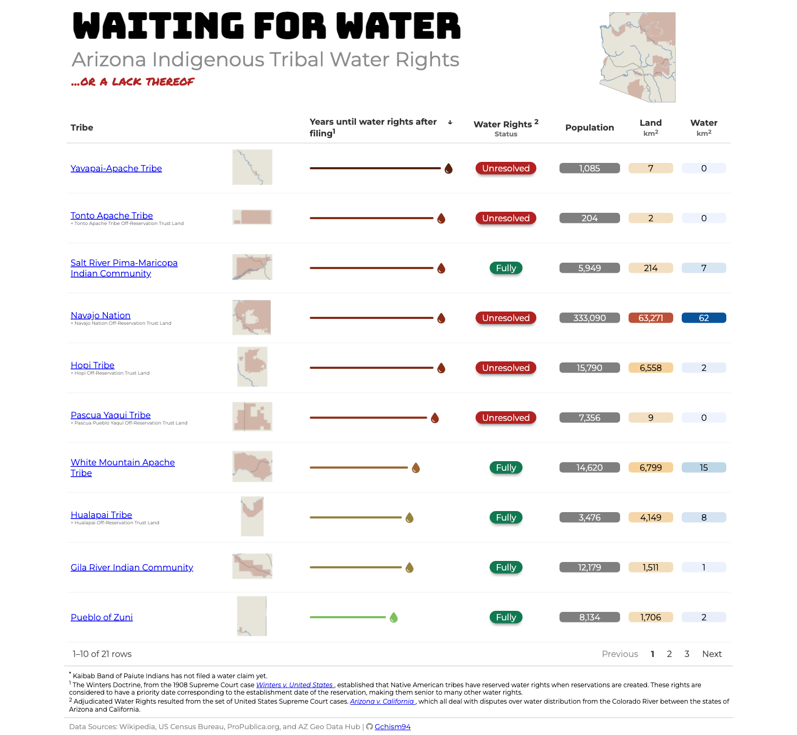

# Posit Table Contest Submission 2024

### Final Table

#### Tutorial/Walkthrough

The steps and final table are published in this repo's [GitHub Page](https://gchism94.github.io/posit-table-2024/). 
Important steps:
1. Creating a complex map plot - both interactive via {ggiraph} + {ggplot2} and static via only {ggplot2}.
2. Creating a function to generate AZ Indigenous Tribal subplot maps (inspired by the 2022 Posit Table Contest Submission by [@jfangmeier](https://github.com/jfangmeier/table-contest-2022/tree/main)).
3. Creating Header and Footer content for the main table.
4. Creating the main table with {reactable} and {reactablefmtr}. 

## File Organization

    data/
    |
    ├── azLakes/
    │   ├── Major_Lakes.shp                              # Shapefile for AZ major lakes
    │   └── ...                                          # Supporting files necessary for utilizing the Shapefile
    ├── azRivers/
    │   ├── Major_Rivers.shp                             # Shapefile for AZ major rivers
    │   └── ...                                          # Supporting files necessary for utilizing the Shapefile
    ├── azTribes/
    │   ├── American_Indian_Reservations_in_Arizona.shp  # Shapefile for US Federally Recognized AZ Indigenous Tribal Reservations
    │   └── ...                                          # Supporting files necessary for utilizing the Shapefile
    ├── Cen_AZ_Proj/
    │   ├── Cen_AZ_Proj.shp                              # Shapefile for The Central Arizona Project
    │   └── ...                                          # Supporting files necessary for utilizing the Shapefile
    ├── output/                                          # location of the final table produced by index.qmd in R/
    └── R/                  
        └── index.qmd                                    # Tutorial/write-up for the project